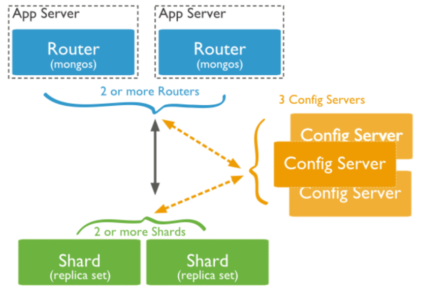

## `Mongo` 集群部署


### 1. 分片复制集群架构



> - `mongos`：提供路由数据库集群请求的入口，所有的请求都通过 `mongos` 进行协调，不需要在应用程序添加一个路由选择器，`mongos` 自己就是一个请求分发中心，它负责把对应的数据请求转发到对应的 `shard` 服务器上。在生产环境通常有多 `mongos` 作为请求的入口，防止其中一个挂掉所有的 `mongodb` 请求都没有办法操作。
> - `config server`：为配置服务器，存储所有数据库元信息（路由、分片）的配置。`mongos` 本身没有物理存储分片服务器和数据路由信息，只是缓存在内存里，配置服务器则实际存储这些数据。`mongos` 第一次启动或者关掉重启就会从 `config server` 加载配置信息，以后如果配置服务器信息变化会通知到所有的 `mongos` 更新自己的状态，这样 `mongos` 就能继续准确路由。在生产环境通常有多个 `config server` 配置服务器，因为它存储了分片路由的元数据，防止数据丢失！
> - shard：分片（`sharding`）是指将数据库拆分，将其分散在不同的机器上的过程。将数据分散到不同的机器上，不需要功能强大的服务器就可以存储更多的数据和处理更大的负载。基本思想就是将集合切成小块，这些块分散到若干片里，每个片只负责总数据的一部分，最后通过一个均衡器来对各个分片进行均衡（数据迁移），从3.6版本开始，每个 `shard` 必须部署为副本集（`replica set`）架构。


### 2. 集群部署规划

| `name` | `ip` | `mongos` |  `config server`    | `shard cluster 1` |  `shard cluster 2`   |
| :-----: | :------: | :--: | :--: | :--: | :--: |
| `node-01` | 127.0.0.1 | 27090 | 27080 | 27117 | 27217 |
| `node-02` | 127.0.0.1 | 27091 | 27081 | 27118 | 27218 |
| `node-03` | 127.0.0.1 | 27092 | 27082 | 27119 | 27218 |

> `config server` 配置服务器建议部署为包含3个成员的副本集模式，出于测试目的，您可以创建一个单成员副本集；
> `shard` 分片请使用至少包含三个成员的副本集。出于测试目的，您可以创建一个单成员副本集；
> `mongos` 没有副本集概念，可以部署1个、2个或多个。


### 3. 下载安装文件

> 下载安装文件

- 以 `Ubuntu` 为例： https://fastdl.mongodb.org/linux/mongodb-linux-x86_64-ubuntu2004-5.0.5.tgz

- 其他系统下载：https://www.mongodb.com/try/download/community


> 解压并验证安装包是否可用

```bash
# 解压
tar zxvf mongodb-linux-x86_64-ubuntu2004-5.0.5.tgz

# 进入 bin 目录，测试 mongod 是否可用
cd bin
./mongod -h
```


### 4. 配置 `shard` 复制集

#### 4.1 创建文件目录

>  分别创建两个复制集（`shard-cluster`）目录，多个以此类推 `shard-cluster-N`

```bash
cd /data

mkdir -p mongodb/dc3/shard-cluster-01 mongodb/dc3/shard-cluster-02
```


> 为每个复制集创建三个分片 `node` 节点目录，多个以此类推 `node-N`

```bash
cd shard-cluster-N

mkdir node-01 node-02 node-03
```


> 为每个分片节点创建配置、数据、日志和Key目录，其他节点操作一致

```bash
cd node-N

mkdir data etc keys logs
```


#### 4.2 配置文件

> 在每个分片节点的 `etc` 下添加配置文件 `mongo.conf `

```yaml
processManagement:
    fork: true

systemLog:
    destination: file
    # 指定 mongod 服务日志文件目录，其他节点以此类推
    path: /data/mongodb/dc3/shard-cluster-01/node-01/logs/mongodb.log
    logAppend: true

storage:
    journal:
        enabled: true
    # 指定数存放的路径，其他节点以此类推
    dbPath: /data/mongodb/dc3/shard-cluster-01/node-01/data/
    directoryPerDB: true
    # 选择存储引擎
    engine: wiredTiger
    wiredTiger:
        engineConfig:
            # 指定存储引擎的 cache 大小
            cacheSizeGB: 20
            directoryForIndexes: true
        collectionConfig:
            blockCompressor: snappy
        indexConfig:
            prefixCompression: true

net:
    # 设置 mongod 监听端口
    port: 27117
    # 设置最大连接数
    maxIncomingConnections: 10000
    bindIpAll: true

operationProfiling:
    # 设置慢日志时间
    slowOpThresholdMs: 100
    mode: slowOp

# 是否支持分片
sharding:
    clusterRole: shardsvr
    archiveMovedChunks: true

replication:
    oplogSizeMB: 10240
    # 表示这是 dc3_replica 集群的第一个分片
    # 该复制集中的所有 node 节点这个名字要一样
    # 如果是第二个复制集，这里可以取名 dc3_replica_2
    replSetName: dc3_replica_1

#security:
#    # 指定 keyfile 位置，其他节点以此类推
#    keyFile: /data/mongodb/dc3/shard-cluster-01/node-01/keys/keyfile
#    clusterAuthMode: keyFile
#    authorization: enabled
```


#### 4.3 启动

```bash
/usr/local/mongodb/bin/mongod -f /data/mongodb/dc3/shard-cluster-01/node-01/etc/mongo.conf

/usr/local/mongodb/bin/mongod -f /data/mongodb/dc3/shard-cluster-01/node-02/etc/mongo.conf

/usr/local/mongodb/bin/mongod -f /data/mongodb/dc3/shard-cluster-01/node-03/etc/mongo.conf

/usr/local/mongodb/bin/mongod -f /data/mongodb/dc3/shard-cluster-02/node-01/etc/mongo.conf

/usr/local/mongodb/bin/mongod -f /data/mongodb/dc3/shard-cluster-02/node-02/etc/mongo.conf

/usr/local/mongodb/bin/mongod -f /data/mongodb/dc3/shard-cluster-02/node-03/etc/mongo.conf
```


#### 4.4 分片 `node` 节点配置到 `shard` 复制集

> 不同  `shard` 复制集中的分片节点操作一致

```bash
# 登录第一个复制集中任意一个分片 node 节点
/usr/local/mongodb/bin/mongo --port 27117

# 执行以下配置，注意 id、ip、port 配置无误
config = {
  "_id": "dc3_replica_1",
  "members": [
    {
      "_id": 0,
      "host": "127.0.0.1:27117"
    },
    {
      "_id": 1,
      "host": "127.0.0.1:27118"
    },
    {
      "_id": 2,
      "host": "127.0.0.1:27119"
    }
  ]
};

rs.initiate(config);

# 查看分片集中的节点状态
rs.status();

# 退出
exit

---

# 登录第二个复制集中任意一个分片 node 节点
/usr/local/mongodb/bin/mongo --port 27217

# 执行以下配置，注意 id、ip、port 配置无误
config = {
  "_id": "dc3_replica_2",
  "members": [
    {
      "_id": 0,
      "host": "127.0.0.1:27217"
    },
    {
      "_id": 1,
      "host": "127.0.0.1:27218"
    },
    {
      "_id": 2,
      "host": "127.0.0.1:27219"
    }
  ]
};

rs.initiate(config);

# 查看分片集中的节点状态
rs.status();
```


### 5. 配置 `config server` 集群

#### 5.1 创建文件目录

>  创建一个配置服务（`config-cluster`）目录

```bash
cd /data

mkdir -p mongodb/dc3/config-cluster
```


> 为配置服务创建三个 `node` 节点目录，多个以此类推 `node-N`

```bash
cd mongodb/dc3/config-cluster

mkdir node-01 node-02 node-03
```


> 为每个节点创建配置、数据、日志和Key目录，其他节点操作一致

```bash
cd node-N

mkdir data  etc  keys  logs
```


#### 5.2 配置文件

> 在每个节点的 `etc` 下添加配置文件 `config.conf `

```yml
processManagement:
    fork: true

systemLog:
    destination: file
    # 指定 mongod 服务日志文件目录，其他节点以此类推
    path: /data/mongodb/dc3/config-cluster/node-01/logs/mongodb.log
    logAppend: true

storage:
    journal:
        enabled: true
    # 指定数存放的路径，其他节点以此类推
    dbPath: /data/mongodb/dc3/config-cluster/node-01/data/
    directoryPerDB: true
    # 选择存储引擎
    engine: wiredTiger
    wiredTiger:
        engineConfig:
            # 指定存储引擎的 cache 大小
            cacheSizeGB: 20
            directoryForIndexes: true
        collectionConfig:
            blockCompressor: snappy
        indexConfig:
            prefixCompression: true

net:
    # 设置 mongod 监听端口
    port: 27080
    # 设置最大连接数
    maxIncomingConnections: 10000
    bindIpAll: true

operationProfiling:
    # 设置慢日志时间
    slowOpThresholdMs: 100
    mode: slowOp

# 是否支持分片
sharding:
    clusterRole: configsvr
    archiveMovedChunks: true

replication:
    oplogSizeMB: 10240
    # 需要和 mongos configDB 配置中的名字一致
    replSetName: dc3_replica

#security:
#    # 指定 keyfile 位置，其他节点以此类推
#    keyFile: /data/mongodb/dc3/config-cluster/node-01/keys/keyfile
#    clusterAuthMode: keyFile
#    authorization: enabled
```


#### 5.3 启动

```bash
/usr/local/mongodb/bin/mongod -f /data/mongodb/dc3/config-cluster/node-01/etc/config.conf

/usr/local/mongodb/bin/mongod -f /data/mongodb/dc3/config-cluster/node-02/etc/config.conf

/usr/local/mongodb/bin/mongod -f /data/mongodb/dc3/config-cluster/node-03/etc/config.conf
```


#### 5.4 配置 `node` 节点到 `config server` 服务

```bash
# 登录任意一个 node 节点
/usr/local/mongodb/bin/mongo --port 27080

# 执行以下配置，注意 id、ip、port 配置无误
config = {
  "_id": "dc3_replica",
  "members": [
    {
      "_id": 0,
      "host": "127.0.0.1:27080"
    },
    {
      "_id": 1,
      "host": "127.0.0.1:27081"
    },
    {
      "_id": 2,
      "host": "127.0.0.1:27082"
    }
  ]
};

rs.initiate(config);

# 查看配置服务中节点的状态
rs.status();
```


### 6. 配置 `mongos` 服务

#### 6.1 创建文件目录

>  创建一个路由服务（`mongos-cluster`）目录

```bash
cd /data

mkdir -p mongodb/dc3/mongos-cluster
```


> 为路由服务创建一个 `node` 节点目录，多个以此类推 `node-N`

```bash
cd mongodb/dc3/mongos-cluster

mkdir node-01
```


> 为每个节点创建配置、日志和Key目录，其他节点操作一致

```bash
cd node-N

mkdir etc  keys  logs
```


#### 6.2 配置文件

> 在每个节点的 `etc` 下添加配置文件 `mongos.conf `

```yaml
processManagement:
    fork: true
    pidFilePath: /data/mongodb/dc3/mongos-cluster/node-03/mongos.pid

systemLog:
    destination: file
    logAppend: true
    path: /data/mongodb/dc3/mongos-cluster/node-03/logs/mongos.log

net:
    # 设置 mongod 监听端口
    port: 27090
    maxIncomingConnections: 10000
    bindIpAll: true

sharding:
    # 这里的的 dc3_replica 必须和 mongs configDB 配置名称一致
    # 这里的三个地址为 mongo-cfg 集群的地址
    configDB: dc3_replica/127.0.0.1:27080,127.0.0.1:27081,127.0.0.1:27082

#不带认证需要屏蔽这两行配置
#security:
#    keyFile: /data/mongodb/dc3/mongos-cluster/node-03/keys/keyfile
#    clusterAuthMode: keyFile
#    authorization: enabled
```


#### 6.3 启动

```bash
/usr/local/mongodb/bin/mongos -f /data/mongodb/dc3/mongos-cluster/node-01/etc/mongos.conf
```


#### 6.4 配置 `shard` 复制集到 `mongos` 服务

```bash
# 登录任意一个 node 节点
/usr/local/mongodb/bin/mongo --port 27090

sh.addShard("dc3_replica_1/127.0.0.1:27117,127.0.0.1:27118,127.0.0.1:27119");
sh.addShard("dc3_replica_2/127.0.0.1:27217,127.0.0.1:27218,127.0.0.1:27219");

# 查看路由服务节点的状态
sh.status();
```

